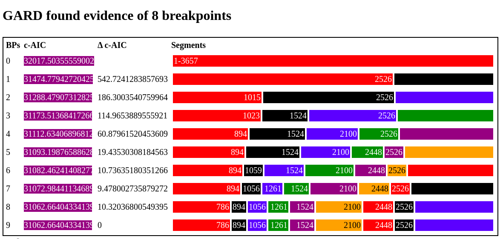
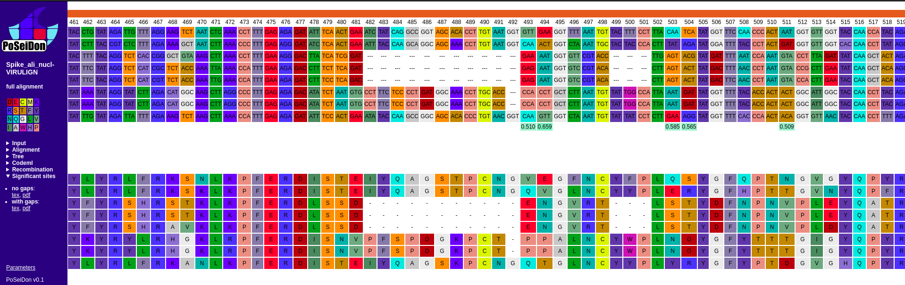
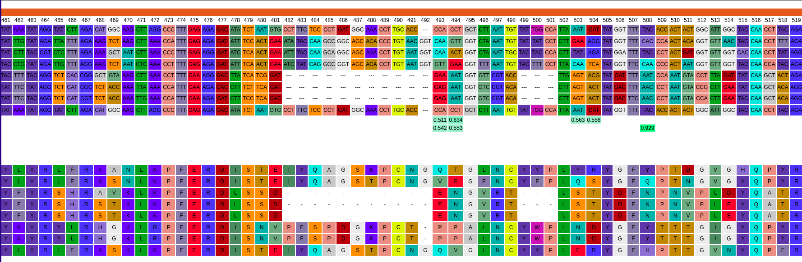

# PoSeiDon: SARS-CoV-2 example

 


[](https://twitter.com/martinhoelzer) 

## Background

The following example is based on a recent publication of [Zhou _et al_. 2020](https://www.cell.com/current-biology/pdf/S0960-9822(20)30662-X.pdf) about a novel bat Coronavirus closely related to SARS-CoV-2. The coding sequences of the spike protein used here were selected from GISAID and kindly provided by Bálint Mészáros (Thanks!). 

This example will illustrate how PoSeiDon can be used to generate an in-frame alignment from a set of protein-coding sequences and check the alignment for possible recombination events and positively selected sites. We will compre the output of PoSeiDon with results shown in [Zhou _et al_. 2020](https://www.cell.com/current-biology/pdf/S0960-9822(20)30662-X.pdf), in particular, we will compare the HTML output of PoSeiDon with the alignment and important amino acide sites shown in Figure 2G and H in the publication. 

__Disclaimer:__ Here, we will only perform a recombination and positive slection analysis based on eight sequences out of the nine shown in Figure 2. Please keep in mind, that a sample size of eight is low for such an analysis and thus the statistical support of reported positively selected sites is low. Below, we will discuss some interesting sites that are in line with previously reported sites for SARS-CoV-2, however, they are not reported as significant (posterior probability >= 0.95; PP) by PoSeiDon. The selection of input sequences always has a strong impact on such an evolutionary analysis and a balanced set of 15-20 sequences would likely result in way better PPs. Nevertheless, this small example shows the output of PoSeiDon in comparison to the results of [Zhou _et al_. 2020](https://www.cell.com/current-biology/pdf/S0960-9822(20)30662-X.pdf). The authors did not perform a positive selection analysis, however, they discuss important sites in the spike protein of different Coronaviruses that were also previously characterized. 

## Data

* [FASTA](Spike_ali_nucl-VIRULIGN.fasta)

The FASTA file contains eight Coronavirus sequences of the gene encoding the spike protein. To the best of our knowledge, the sequences correspond to the sequences shown in Figure 2 ([Zhou _et al_. 2020](https://www.cell.com/current-biology/pdf/S0960-9822(20)30662-X.pdf)):

* `>SARS-CoV-2|GISAID:EPI_ISL_402124` 
* `>RmYN02|GISAID:EPI_ISL_412977`
* `>RaTG13|GISAID:EPI_ISL_402131`
* `>ZC45|NCBI:MG772933`
* `>ZXC21|NCBI:MG772934` 
* `>pangolin/GX/P5L/2017|GISAID:EPI_ISL_410540` 
* `>GZ02|NCBI:AY390556`
* `>SARS-CoV|GenBank:AY278741` 

However, we were not able to extract all identical sequences from GISAID used in the publication. (again, thanks to Bálint Mészáros for providing this data for testing!). Nevertheless, there is a huge overlap and the results are in line with the known positions. 

__Attention!__ The sequences in the FASTA file were already aligned with [VIRULIGN](https://github.com/rega-cev/virulign), however, PoSeiDon performs its own in-frame alignment and thus gap symbols in sequences are simply ignored. Thus, some of the few differences between the PoSeiDon output and Figure 2 (mainly in the indices of codons in the alignment) come from differences in gapped regions of the alignments.   


## Execution

We run PoSeiDon in version [bb48dce7](https://github.com/hoelzer/poseidon/tree/bb48dce773c264082d019c4745e4b8de73d6182e) with the following command:

```bash
nextflow run poseidon.nf --fasta Spike_ali_nucl-VIRULIGN.fasta --cores 8
```

The full output can be [downloaded](Spike_ali_nucl-VIRULIGN.tar.gz) or directly [investigated in the browser](http://www.rna.uni-jena.de/supplements/poseidon/Spike_ali_nucl-VIRULIGN/html/full_aln). 

## Results

### Recombination

PoSeiDon (using GARD) detected many potential breakpoints and one (2526; based on the alignment w/o gaps that GARD uses for testing) that is significant (and is therefore considered by PoSeiDon in the downstream analysis).



### Positive selection

PoSeidon performs positive selection detection using CODEML on the full alignment and potential fragments based on detected recombination events (breakpoints) with GARD. Recombination events can have a large impact on the positive selection detection.

In the following, we will discuss the few positions identified as positive selected (with very weak posterior probability support, mainly due to low sample size) in comparison to Figure 2. The same alignment part that is shown in Figure 2G starting from alignment position 451 ([Zhou _et al_. 2020](https://www.cell.com/current-biology/pdf/S0960-9822(20)30662-X.pdf)) is shown below in the PoSeiDon output starting on position 461 (due to differences in the alignment):



Again, please keep in mind that no positive selection tests are significant for this small example. However, there are few sites with weak support for positive selection (493, 494, 503, 504, and 511). When looking at the same position in the fragment:



there are similar (weakly) positively selected sites: 493, 494, 503, 504, and 508. Actually, position 508 (corresponds to 498 in the Figure 2G) is found with one of the best supports for positive selection. The position seems to be not known to be of importance in the spike protein, however, it is found with low evidence by PoSeiDon.

Positions 503 and 504 (corresponding to marked positions 493 and 494 in Figure 2) have very week support but, at least, are identified as potentially positively selected by the pipeline. 

Previous studies already showed "Six amino acid residues at the RBD (L455, F486, Q493, S494, N501, and Y505) have been reported to be major determinants of efficient receptor binding of SARS-CoV-2 to ACE2" ([Zhou _et al_. 2020](https://www.cell.com/current-biology/pdf/S0960-9822(20)30662-X.pdf)). Due to differences in the alignment these positions can not directly found in the PoSeiDon output but correspond to: 

L455     = L465 --> no hit in PoSeiDon
F486     = F496 --> no hit in PoSeiDon 
Q493     = Q503 --> low support in full aln and fragment 1
S494     = S504 --> low support in full aln and fragment 1
N501     = N511 --> low support in full aln
Y505     = Y515 --> no hit in PoSeiDon 

In summary, only based on the eight coding sequences for the spike protein, PoSeiDon detected three out of the six previously reported positions to be positively selected (although with very low support due to sample size) and an additional position (508), that was only found based on the initial recombination detection and splitting of the alignment. 

## Acknowledgement

I would like to thank the authors of [Zhou _et al_. 2020](https://www.cell.com/current-biology/pdf/S0960-9822(20)30662-X.pdf) and in particular Bálint Mészáros for patiently testing PoSeiDon and for providing the selected spike coding sequences.

## Citation

If PoSeiDon helps you please cite:

[Martin Hölzer and Manja Marz, "PoSeiDon: a Nextflow pipeline for the detection of evolutionary recombination events and positive selection", _BioRxiv_ (2020)](https://www.biorxiv.org/content/10.1101/2020.05.18.102731v1)
